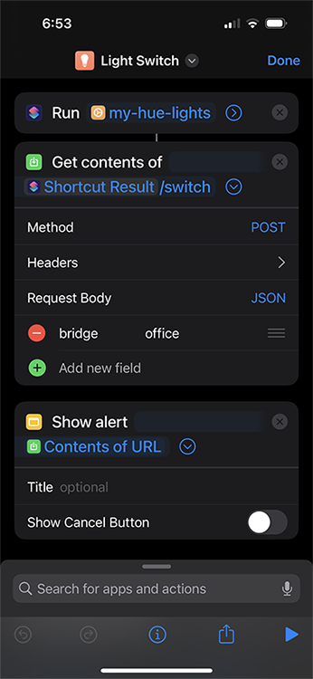

# my-hue-lights
The Philips Hue app has some neat iOS Shortcuts actions that allow you to turn your lights on or off and more. This is a fun opportunity to set up some custom shortcuts to accomplish a simple light switch.

## Environment Requirements
-	1+ Philips Hue Light Bulb(s)
-	1+ Philips Hue Bridge(s)
-	Linux Computer. [Method 2](#method2) Only. I used a Raspberry Pi 4 running Raspbian GNU/Linux 11 (bullseye) with access to:
    -	Docker
    -	Make
    -	Git
-	iPhone running iOS 13+ (I only tested using iOS 16, so this could be wrong)
-	Access to a local area network, preferring wired connections where possible.

## Product Requirements

- **Single Shortcut Light Switch Per Room:**<br> 
I don’t want two shortcuts for on AND off. I want a single shortcut, so that it takes up less space in my Shortcuts widget on the Today View. (Did anyone know that it’s called the Today View? …)
- **Needs to be accessible without having to unlock the iPhone:**<br>
There are apps that let you run shortcuts from the new iOS 16 lock screen widgets. The problem with these is that they open the shortcuts app to run the shortcut. That’s why I’m opting to use the shortcuts widget on the Today View. That way the switches are single swipe away.
- **The shortcut needs to complete fast:**<br>
My goal is to try and at least match the Philips Hue App’s shortcut actions’ times for simple on/off commands. Using [Method 2](#method2) on a Raspberry Pi 4 it is sometimes faster. Using [Method 2](#method2) on am Ubuntu VM it is consistently faster than [Method 1](#method1).

## Usage

I found two methods of achieving a Philips Hue light switch shortcut for iOS. If you don't want to set up the shortcuts yourself see `/iOS`.

<a id="method1"></a>
### **Method 1: A Simple Light Switch (no Linux machine needed)**

To make a switch shortcut we need to be able to do one of two things: Remember the last state we left a Light or ask the light for its state. Method 1 will focus on remembering the last state we left a light. To do this we need permanent memory storage for our light switch shortcut on the iOS device. I found a blog post that describes a very clever way of using the a memory shortcut you can download and the Reminders app to store data using JSON dictionaries. Check out Dan Wilson’s post here to set this up first: https://nadnosliw.wordpress.com/2021/10/28/persistent-variables-for-ios-and-ipados-shortcuts/

Once we have the memory shortcut, we’ll start by making two shortcuts to get/set the value of a light/room. See `/iOS` for pre-built shortcuts.

|||
|:--:|:--:|
|  |  |
| <p>A shortcut that runs the get method on the memory shortcut and returns the value of a variable named after the Philips Hue light.</p> | <p>A shortcut that runs the post method on the memory shortcut to store a On or Off value for the Philips Hue light variable.</p> |


<p>Once the set/get shortcuts are ready, we can make a third and final shortcut to act as a switch. If it so happens that the Philips Hue light’s state has changed without our shortcut memory knowing, we just need to run the shortcut twice so that it is synced again.</p>

|||
|:--:|:--:|
|  |  |
| <p>If the office light is On, set the memory value to Off. Call the Philips Hue shortcut action to turn off the lights in a room or light.</p> | <p>If the light is Off, set the memory value to On. call the Philips Hue shortcut action to turn on the lights in a room or light.</p> |

<p>And that’s it! The shortcut will ask you to approve the use of other shortcuts, but only the first time you run it. Use the Today View to quickly access your digital light switch! The Philips Hue shortcut actions can sometimes be a little slow. Turning off “Show when run” cuts down on some of the runtime, but then the shortcut provides no feedback to the user.</p>

||
|:--:|
|  |
|  |

<a id="method2"></a>
### **Method 2: my-hue-lights**

This method uses the code in this repository to spin up a gunicorn flask app in a docker container. Start by cloning or downloading the source.

Edit the `conf.yaml` to include your Philips Hue Bridge's ID. You can find the ID in the Philips Hue App.

``` YAML
bridges:
  office:
    url: abcdef123456
  living-room:
    url: abcdef123456
```

In `my-hue-lights/` build the docker containers using

    make build

This might take some time depending on the system. I've added https://www.piwheels.org/simple to the `pip.conf` for pip to save time on compiling for the Raspberry Pi.

During the build process it will ask you to press the buttons on each of the Bridges within the last 30 Seconds. After the build has completed you can run the service using:

    make run

or in the background using:

    make run-detach

If you only made changes to the python source code, then you can avoid having to build the venv and clicking the buttons everytime by using:

    make reload-run

or to run in the background

    make reload-run-detach

Usually you'll need to clean before you can build again:

    make clean

Once `my-hue-lights` is running you'll want to take note of the hostname of the computer you're running it on. Set up or download the Shortcut to retrieve the URL to `my-hue-lights`. See `/iOS` for pre-built shortcuts.

|||
|:--:|:--:|
|  |  |
| A shortcut that returns the URL of the **my-hue-lights** server. | A shortcut that sends a POST request to <b>my-hue-lights</b> to switch all lights connected to 'bridge'. Add a 'name' field to specify a specific Light. |
|  |  |
    
<p><b>my-hue-lights</b> also features a color selection endpoint. There is a very clever way we can use it in our Shortcuts.</p>

|||
|:--:|:--:|
|  |  |
| <p>A shortcut that requests the color_flipbook.gif from <b>my-hue-lights</b>, splits each frame into a jpeg, prompts the user to choose a frame(color) from the list, and POSTs the image to the server to set a bridge/light's color.</p> ||
|  |  |
    
